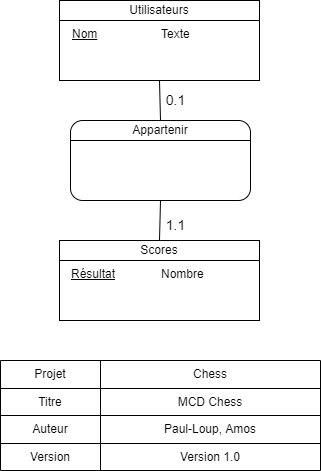
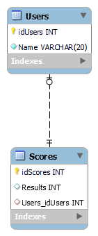

# Chess game

## Description
Développement d’un jeu d’échec revisité en C# avec une base de donné MySQL.

L’objectif est d’approfondir nos connaissances en C# et en MySQL pour créer un jeu d’échec revisité. Un premier niveau de difficulté débutant sera de placé aléatoirement les pièces et dans un deuxième niveau de difficulté normal sera une IA qui placera ces propres pièces contre le joueur.

### Installation ###

* Cloner le dépôt https://github.com/Paul-LoupGermain/Chess.git

* Visual Studio Entreprise 2022.

* Première tentative de compilation.

* HeidiSQL - Microsoft SQL Server Managment Studio.

* Lancement du fichier CreateDataBase.sql.

### Architecture

**Auteur**

Paul-Loup Germain

25-NOV-2022